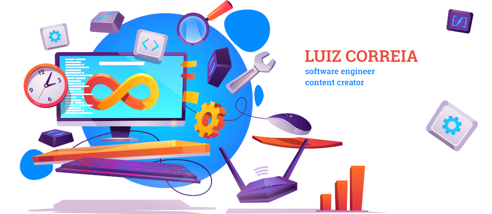

## Hi, I'm Luiz Correia 👋
### A passionate creative engineer, cloud architect and developer from Brazil

I'm a software engineer who is passionate about making new technology more accessible to everyone, creating smart technology to make people smart, and building community.

> I believe creative technologies are indistinguishable from works of art.

Some technologies I enjoy working with include Typescript, Python, Go, Lua. 

- 🔭 I’m currently working on [Smart VW T2 Van](https://instagram.com/nossakombeth)

- 🌱 I’m currently learning **haskell, gRPC, AR, VR**

- 🤝 I’m looking for help with [scorm-react-provider](https://github.com/luizcorreia/scorm-react-provider)

- 📝 I regularly write articles on [https://luizcorreia.eti.br](https://luizcorreia.eti.br)

- 💬 Ask me about **vim, linux, typescript, aws**

- 📫 How to reach me **luiz@luizcorreia.eti.br**

I'm in love with the AWS platform.
Now building a [Smart VW T2 Van](https://instagram.com/nossakombeth) the talk with Alexa.

### Languages and Tools:

                                                             

 
 

## Find me around the web 🌎:

Sharing updates on <a href="https://luizcorreia.eti.br/"> My website </a>

#### Here some of my social:
    

 

## Latest Blog Posts
<!-- BLOG-POST-LIST:START -->
- [Git warning: Pulling without specifying how to reconcile divergent branches is discouraged](https://luizcorreia.eti.br/git-warning-pulling-without-specifying-how-to-reconcile-divergent-branches-is-discouraged/)
- [Explore o novo recurso README do Github](https://luizcorreia.eti.br/new-gihub-readme/)
- [TypeScript: Declarando Mongoose Schema + Model](https://luizcorreia.eti.br/typescript-declarando-mongoose-schema-model/)
- [Mapeando os casos do Wuhan Coronavirus](https://luizcorreia.eti.br/wuhan-coronavirus/)
- [LGPD: A lei geral de proteção de dados](https://luizcorreia.eti.br/lgpd-a-lei-geral-de-protecao/)
<!-- BLOG-POST-LIST:END -->

<!--

**luizcorreia/luizcorreia** is a ✨ _special_ ✨ repository because its `README.md` (this file) appears on your GitHub profile.

Here are some ideas to get you started:

- 🔭 I’m currently working on ...
- 🌱 I’m currently learning ...
- 👯 I’m looking to collaborate on ...
- 🤔 I’m looking for help with ...
- 💬 Ask me about ...
- 📫 How to reach me: ...
- 😄 Pronouns: ...
- ⚡ Fun fact: ...
-->
